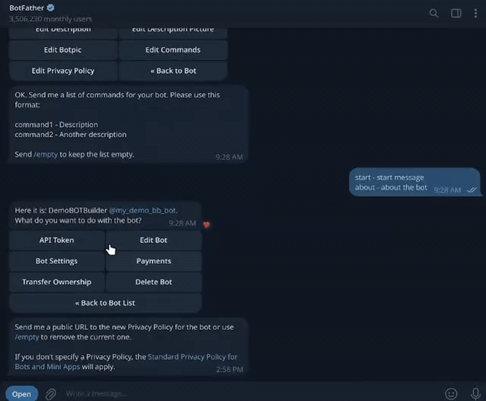

# 🛡️ TG AntiSpam Bot

A production-ready minimal Telegram bot that protects groups and supergroups from spam using a **trust-based moderation system**.

The bot automatically removes suspicious messages from new users while allowing legitimate members to communicate freely - without captchas, delays, or manual moderation.

---

## 🎥 Demo

> *Short demos are worth more than long explanations*

**Spam message deletion and Admin (group management):**


Notification of AI service failures to admin:


**Bot rights via BotFather:**


**Admin rights in a group for bot to delete messages:**


---

## ⭐ Key Features

* **Trust-based Anti-Spam**

  * New users are monitored more strictly
  * Trusted users are never interrupted
* **Automatic Spam Deletion**

  * Links, mentions, and suspicious entities are removed
* **Admin Panel**

  * Enable or disable protection per group
  * See all chats the bot is present in
* **Async Queue Processing**

  * Handles high message volume safely
* **Polling & Webhook modes**
* **Persistent Storage**

  * SQLite + migrations
* **Clean Architecture**

  * Filters, middleware, services, registry cache

## 🧠 AI-Powered Contextual Spam Detection (Optional)

The bot can optionally use an AI-based contextual analyzer to detect suspicious messages that bypass classic heuristics.

This feature is disabled by default and works as an additional signal on top of the trust-based system - not a replacement.

### What the AI detects

The AI model analyzes message intent and context, not just keywords.
It helps catch messages like:

* Funnel / solicitation phrasing
  * "write me in DM"
  * "details in PM"
  * "contact privately"
* Cross-language bait (RU / EN mixed messages)
* Indirect advertising without links
* Rephrased spam that avoids obvious patterns

### How it works

1. Message passes basic filters (chat type, trust level)
2. If enabled, the message is sent to the AI analyzer
3. The analyzer runs a **Prompt Pack** (multiple prompts) sequentially
4. Each prompt returns a risk score (0.0–1.0)
5. If **any** prompt score reaches the configured threshold - the message is flagged
6. The decision is applied by the AntiSpamService (AI affects deletion only)

The AI never auto-bans users - it only influences message deletion.

### Prompt Pack (multiple prompts)

The bot supports running **any number of prompts** stored as plain text files in `prompts/`.

**Ordering rule (by filename suffix):**
Prompts are loaded from `prompts/*.txt`
Files are executed **in ascending numeric order** based on the trailing `_N` suffix
Examples (any name instead of `moderation_policy` will work):

0) `moderation_policy.txt` → treated as index `0`
1) `moderation_policy_1.txt`
2) `moderation_policy_2.txt`
3) `moderation_policy_3.txt`
4) …and so on

This lets you keep prompts small and focused (e.g., illegal activity / funnel solicitation / formatting tricks),
and modify the size and amount of prompts depending on the LLM used (bigger models require less prompts and more token budget).

### Design principles

* **Fail-safe** - if AI is unavailable, the bot works normally
* **Low latency** - async queue, non-blocking
* **Deterministic prompts** - prompt order is controlled by filenames
* **Explainable thresholds** - per-message: “hit on prompt #N with score X”
* **Privacy-aware** - messages are not stored by the AI layer

### Configuration

Enable AI moderation via environment variables:

```env
APP_AI_ENABLED=true
APP_AI_MODEL=your_model_name
APP_AI_BASE_URL=your_provider_url | local_ollama_url
APP_AI_API_KEY=your_api_key
````

If configuration is incomplete, the AI service is automatically skipped.

📄 **Detailed configuration:** [docs/AI.md](docs/AI.md)
📄 **Local Ollama API:** [docs/OLLAMA.md](docs/OLLAMA.md)

### Supported modes

* **Local models via Ollama**
* **OpenAI-compatible APIs**

---

## ❓ How It Works

The bot uses a **trust model** instead of hard rules:

1. **New users**

   * Messages with links or mentions may be deleted
2. **Trust building**

   * Time spent in chat
   * Number of clean messages sent
3. **Trusted users**

   * No moderation
   * No delays
   * No false positives

This approach keeps chats clean **without annoying real people**.

---

## 🪛 Configuration

Configuration is done via environment variables.

📄 **Full explanation:** [`docs/ENV.md`](docs/ENV.md)
📄 **Example file:** [`.env.example`](.env.example)

Minimal required variables:

```env
APP_BOT_TOKEN=your_bot_token_here
APP_MAIN_ADMIN_ID=your_telegram_user_id
```

Everything else has safe defaults.

---

## 📦 Installation

### 🐳 Docker (Recommended)

📄 **Detailed guide:** [`docs/DOCKER.md`](docs/DOCKER.md)

```bash
git clone <repository-url>
cd TGAntiSpamBot

cp .env.example .env
# edit .env

make run
```

The database and logs (depending on the env) are persisted automatically.

[Make](https://en.wikipedia.org/wiki/Make_(software)) is the preferred tool for local development. Otherwise, you can use the docker-compose.yml file directly.

---

### Production / Development Setup

📄 **make usage:** [`docs/MAKE.md`](docs/MAKE.md)
📄 **docker usage:** [`docs/DOCKER.md`](docs/DOCKER.md)
📄 **uv usage:** [`docs/UV.md`](docs/UV.md)

---

## 🤖 Bot Commands

### Private chats only

* `/start` - Welcome message
* `/about` - Bot description

For admin only:

* `/chats` - Admin panel
* `/metrics` - Runtime metrics
* `/test_ai` - Test AI service

Only if fun is enabled via .env:

* `/dice` - Roll a dice 🎲
* `/slot` - Slot machine 🎰

---

## 🛠️ Admin

Accessible via `/chats` (private chat, admin only).

Allows you to:

* View all groups (after adding there bot, giving admin rights and sending any message in the group after bot join by any user)
* Activate / deactivate anti-spam per group
* Navigate chats with pagination
* Safely manage large numbers of groups

---

## 🧩 Architecture Overview

* **Filters** - chat type, admin-only, private-only
* **Middleware**

  * DB session lifecycle
  * Chat registry cache
* **Services**

  * AntiSpamService (queue + workers)
  * ChatRegistry (in-memory TTL cache)
* **Database**

  * SQLAlchemy ORM
  * Alembic migrations
* **Bot Runtime**

  * aiogram 3.x

---

## 📁 Project Structure

```text
ai_client/                # AI client (providers/adapters, requests, utils)
├── adapters/             # Provider adapters (Ollama, OpenAI)
├── models/               # Request parts, errors
└── service.py            # Unified AI service
alembic/                  # DB migrations
app/
├── antispam/             # Anti-spam core
│   ├── ai/               # AI moderator + notifier
│   ├── detectors/        # Mentions/links/text normalization
│   ├── processors/       # Message processing pipeline
│   ├── scoring/          # AI scoring + parsing
│   ├── dto.py            # MessageTask and DTOs
│   └── service.py        # AntiSpamService
├── bot/
│   ├── filters/          # Chat/admin filters
│   ├── handlers/         # Message handlers
│   │   ├── admin/        # Admin UI: callbacks, keyboards, renderers, services
│   │   ├── fun/          # Dice/slot etc.
│   │   └── test/         # Test commands (AI test handler)
│   ├── middleware/       # DB session, registry, antispam, security
│   ├── utils/            # Bot helpers (message actions etc.)
│   ├── bootstrap.py      # Bot bootstrap
│   ├── factory.py        # Bot factory (DI wiring)
│   ├── run_polling.py    # Polling entry
│   └── run_webhook.py    # Webhook entry
├── db/                   # Database layer
│   ├── models/           # SQLAlchemy models
│   ├── base.py           # Base model / metadata
│   └── helper.py         # DB helpers
├── services/             # Business services (chat, user, registry, cache)
├── container.py          # App container (DI)
├── monitoring.py         # Metrics / monitoring
└── security.py           # Security helpers
config/                   # Settings (Pydantic)
├── settings.py
├── bot.py
├── ai_client.py
├── database.py
└── logging.py
docs/                     # Documentation
├── AI.md
├── DOCKER.md
├── ENV.md
├── MAKE.md
├── OLLAMA.md
├── TEST.md
├── UV.md
├── gifs/                 # Demo GIFs
└── images/
scripts/                  # Utility scripts (ollama pull)
tests/                    # Tests
utils/                    # Shared utilities
main.py                   # App entrypoint
README.md                 # This file
```

---

## Deployment Modes

### Polling (default)

* No public URL required
* Best for local or simple hosting

### Webhook

* Requires HTTPS and public URL
* Recommended for production

📄 **Webhook details:** [`docs/DOCKER.md`](docs/DOCKER.md)

```env
APP_BOT_MODE=webhook
APP_WEBHOOK_URL=https://your-domain.com
```

---

## Testing

📄 **Testing guide:** [`docs/TEST.md`](docs/TEST.md)

---

## 🤝 Contributing

1. Fork the repo
2. Create a feature branch
3. Write clean, typed code
4. Add tests where reasonable
5. Open a Pull Request

---

## Support

If you:

* found a bug
* want a feature
* need help with setup

➡️ write to the issues section.
